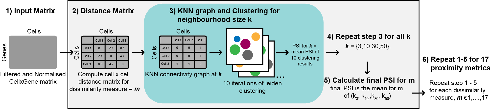

***********
scProximitE
***********

The accurate identification of cell sub-populations is paramount to the quality of downstream analyses and overall
interpretations of single-cell RNA-seq (scRNA-seq) datasets but remains an ongoing challenge for the field.
The quality of single-cell clustering has been demonstrated to be largely dependent on the proximity metric
used to generate cell-to-cell distances provided as input for the clustering algorithm. Accordingly, proximity
metrics have been benchmarked for scRNA-seq clustering previously, with results averaged across numerous datasets
to identify a single metric for recommendation. However, the metric identified as ‘best-performing’ varies between
studies, and the performance of proximity metrics has been found differ significantly between individual datasets.
These results suggest that the unique structural properties of scRNA-seq datasets impacts the performance of proximity
metrics, and as such identification of a single best-performing metric may be impossible. To investigate this,
we developed a framework for the in-depth evaluation of 17 proximity metrics performance with respect to core
structural properties of scRNA-seq data, including sparsity, dimensionality, cell population distribution and rarity.
We find that clustering performance can be improved substantially by the selection of an appropriate proximity metric
and neighbourhood size for the structural properties of a given dataset, as well as suitable processing and dimensionality reduction approaches. Furthermore, popular metrics such as Euclidean and Manhattan distance performed poorly in comparison to several lessor applied metrics, suggesting the default metric of choice for many scRNA-seq methods should be re-evaluated. Our findings highlight the critical nature of tailoring scRNA-seq analyses pipelines to
the dataset at hand and provide practical guidance for researchers looking to optimise cell similarity search
for the structural properties of their own data.

